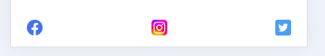

# Visit Cyprus 

The purpose of this website is to encourage tourists to visit Cyprus.
It makes use of plenty of eye catching images to show the best bits of Cyprus. 
It also has accompanying descriptions, which are meant to evoke a sense of wanderlust and encourage visitors to explore the various facets of the island.
The website features a contact page with a from allowing visitors to ask questions of travel experts and request more information.
In the footer, there are links to various social media pages to keep users engaged with the site.
It was designed on a large laptop screen to begin and then made responsive to a range of smaller screens.

View live site here: https://norfolktate.github.io/project-1-cyprus

## Table of Contents

### [User Experience (UX)](#user-experience-ux-1)

* [User Stories](#user-stories)

### [Features](#features)

* [Existing Features](#existing-features)

### [Features Left to Implement](#features-left-to-implement-1)

### [Design](#design-1)

### [Technologies Used](#technologies-used-1)

### [Frameworks, Libraries & Programs Used](#frameworks-libraries--programs-used-1)

### [Testing](#testing-1)

* [Validation Results](#validation-results)
* [Manual Testing](#manual-testing)
* [Fixed Bugs](#fixed-bugs)
* [Lighthouse Report](#lighthouse-report)

### [Deployment and local development](#deployment-and-local-development-1)
* [GitHub Pages](#github-pages)
* [Forking the GitHub Repository](#forking-the-github-repository)
* [Local Clone](#local-clone)

### [Credits](#credits-1)

### [Acknowledgements](#acknowledgements-1)

## User Experience (UX)

This site was originally designed to educate users on Cyprus history and on-going conflict.

As I moved through the building and deployment, I realised it would be better to feature Cyprus in a more positive light so I redesigned the website to Visit Cyprus.

The new website is deisigned to attract tourists to visit Cyprus and showcase the island as a holiday desitination.

The site should envoke joy and excitement.

### User Stories

* First-time visitor goals
  * Understand the main purpose of the site and want to learn more.
  * Easily navigate throughout the site.
  * Find the contact us section and send a follow up question.
* Returning visitor goals
  * Find out information about Visit Cyprus.
  * Locate contact information.
  * Review the gallery in more detail.

* Frequent user goals
  * Be engaged with the question form and the associated social media.

## Features

* This website is targeting those who want to travel to Cyprus for a holiday.
* The site advertises the beauty of CYprus with striking images and accompanying text.
* There is a form that users can send a question to the company.
* Responsive on all device sizes.

### Existing Features

* Navigation bar
  * It is featured on all three pages and the thank-you page.
  * It does not stick to the top as a design decision.
  * Includes links to the home page, gallery, and contact-us page.
  * It is identical in design across the pages.
  * Allows easy navigation from page to page without having to revert back to the previous page via the "back" button.

* Main heading
  * It is composed of a background image featuring the Cypriot coastline.
  * Main heading, which is unique for each page:
    * The home page is "Visit Cyprus, the jewel of the mediterranean".
    * Gallery is simply "Gallery".
    * The contact-us page is "If you have a question for our team please us the form below".
    * The thank-you page simply says "Thank you". 

* Section one
  * This section contains a paragraph detailing the best bits of Cyprus.
  * It leads the user in to the main theme of the webpage.

* Section two
  * This section contains another paragraph specifically about why people should visit.
  * It is accompanied by an image of a Cypriot beach.

* Footer
  * Links to the social media pages will open in a new tab to allow easy navigation for the user.
  * Easy to stay engaged with the site wia social media.

* Gallery
  * The gallery will show striking and colourful images of Cyprus

* The Contact Us page
  * Allows the user to ask further questions and engage with the team. 
  * All fields and required and the question is typed by the user, giving them free reign.

* Thank you page
  * Form submitted sucessfully.
  * Contains a link back to the homepage for user ease.

## Features Left to Implement

* In the future, there will be a more comprehensive page detailing the different areas of Cyprus to visit.
* The contact us page could also be extended to a generic mailing list to keep the user engaged.

## Design

* Colour Scheme
  * The colour scheme used on the site was Orange, white and Black and Blue: 

* Typography
  * The font was from google fonts and is PT Sans

* Wireframes
  * The original wireframe was done on Figma
  * As the website changed directions, a second wire frame was sketched out in a notebook.
  
  

## Technologies Used

* [HTML5](https://en.wikipedia.org/wiki/HTML5)
* [CSS3](https://en.wikipedia.org/wiki/CSS)

## Frameworks, Libraries & Programs Used

* CodeAnywhere - to write the code.
* Github - to deploy the website and store the files online.
* Google Fonts - to import the main font used throughout.
* Figma - to create the original wireframe
* Am I responsive - to create pictures.
* Webaim - to check for contrast colours (Particulary helpful as I am colourblind)

## Testing

The W3C Markup Validator and W3C CSS Validator services were used to validate the website to ensure there were no errors in my code.

* [W3C Markup Validtor](https://validator.w3.org/)
* [W3C CSS Validator](https://jigsaw.w3.org/css-validator/)

### Validation results

* W3C HTML result:
  * Homepage
  

  * Gallery

    

  * Contact page

    

  * Thankyou page

    
* W3C CSS result:

### Manual Testing

* The website was tested on Google Chrome and Microsoft edge.
* The website was viewed on a laptop, a tablet and Samsung phone.
* Testing was done to ensure links between pages are working correctly on all pages.
* Dev Tools was used to test how the site looks on various screen sizes.

### Fixed bugs

These are the documented fixed issues I faced and corrected. Most were fixed with the correct use of Flexbox and a lot of trial and error

* Fix nav section css styling so it aligns with the header
* Fix div positions and fix id for homepage
* Fix div issue so image and text align next to eachother
* Fix form inputs on the footer
* Add fixed form to current affairs page
* Fix html error on hyperlink
* Fix nav bar issues with flex box
* Fix nav bar issues in island page
* Fix sizing issues in footer
* Fix some spelling issues in html code
* Fix styling on headings
* Fix nav bar to correct links in contact page
* Fix footer styling and remove old css styles
* Fix styling to images and text on island page
* Fix header and nav bar
* Fix issue with rgb code in style.css
* Fix issue of images not loading in the readme

### Lighthouse Report

* Home Page

* Gallery

* Contact Us

* Thank you

## Deployment and local development

### GitHub Pages

GitHub Pages used to deploy live version of the website.
1. Log in to GitHub and locate [GitHub repository](https://github.com/NorfolkTate/project-1-cyprus)
2. At the top of the repository locate "Settings" button on the menu.
3. Scroll down the Settings page until you locate "GitHub Pages".
4. Under "Source", click the dropdown menu "None" and select "Main" and click "Save".
5. The page will automatically refresh.
6. Scroll back to locate the now-published site in the "GitHub Pages" section.

### Forking the GitHub Repository

By forking the repository, we make a copy of the original repository on our GitHub account to view and change without affecting the original repository by using these steps:

1. Log in to GitHub and locate [GitHub repository](https://github.com/NorfolkTate/project-1-cyprus)
2. At the top of the repository locate "Fork" button.
3. Now you have a copy of the original in your GitHub account.

### Local Clone

1. Log in to GitHub and locate [GitHub repository](https://github.com/NorfolkTate/project-1-cyprus)
2. Under the repository name click "Clone or download"
3. Click on the code button, select clone with HTTPS, SSH or GitHub CLI and copy the link shown.
4. Open Git Bash
5. Change the current working directory to the location where you want the cloned directory to be made.
6. Type `git clone` and then paste The URL copied in the step 3.
7. Press Enter and your local clone will be created.

---

## Credits

### Code

* Understanding the concept of flexbox was learned through [Complete Guide to Flexbox](https://css-tricks.com/snippets/css/a-guide-to-flexbox/)
* The README template was helpfully provided by [Code Institute (template)](https://github.com/Code-Institute-Solutions/SampleREADME)

### Content

* All content was written by the developer.

### Media

* [Pexels](https://www.pexels.com/) free photos.

## Acknowledgements

* My mentor Mitko Bachvarov provided helpful and patient feedback and a link to the Flexbox guide.
* Slack channels for guidance and encouragement.
